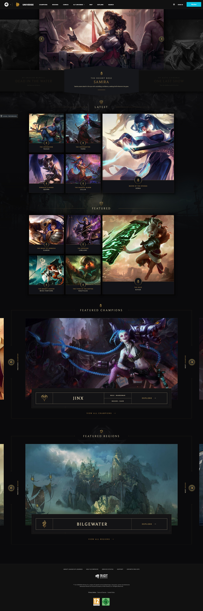
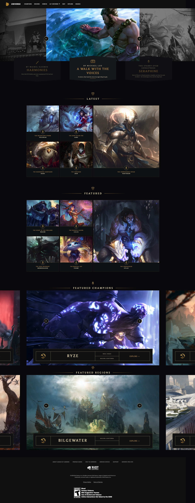
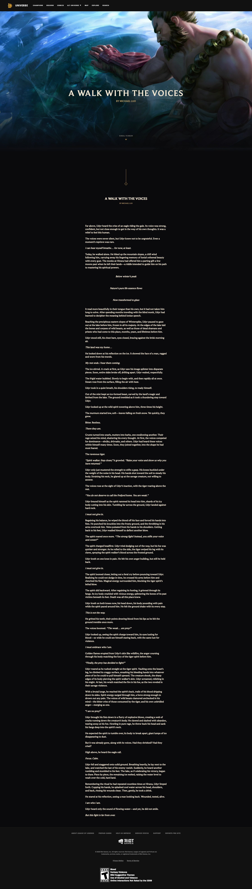

# Procesverslag

**Auteur:** -Maikel Sleebos-

## Bronnenlijst

- [MDN ParentElement](https://developer.mozilla.org/en-US/docs/Web/API/Node/parentElement)
- [Vue.js docs](https://vuejs.org/v2/guide/)
- [Vue CLI](https://cli.vuejs.org/guide/)
- [Vue.js Router](https://router.vuejs.org/guide/)
- [Vue.js References](https://router.vuejs.org/guide/)

Screenshot(s)

## Final Build

[Link naar build](https://senpaizuri.github.io/freespace//dist)

Screenshot(s)

### "Extras"

- Carousel
- Reading Scheme Toggle
- Reading Progress Bar

### Hardships

- Berekening voor progression
  - Was wat lastiger om precies uit te vogelen hoe en wat. Uiteindelijk een rekensom bedacht die min of meer doet wat nodig is.
- Gradients
  - De site heeft een aantal nice gradients op de borders. Uiteindelijk uitgevonden dat ze niet eens borders gebruiken maar extra elementen om een "Border" te krijgen met een gradient.

### Improvements/ToDo's

- Animaties kunnen slicker, Sommige delen zijn op de originele site anderes uitgebouwd om animaties te onderteunen. Hier helaas niet.
- Responsive maken
