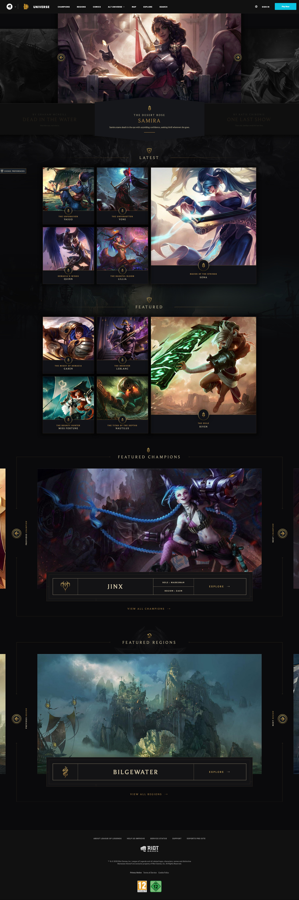

# Procesverslag FreeSpace 20/21

**Student:** Maikel Sleebos

**Student Nr:** 500730177

**Docent:** Ruben Logjes

[Orginele Free Space Formulier](files/Free-Space-formulier.pdf)

## Process

Waar ik mij vooral gericht op heb tijdens freespace is het leren van `Vue` en `SASS`.
Hierbij heb ik voornamelijk documentatie online voor gebruikt om een prototype te maken met een al bestaande website als richtlijn.

Ik heb mij hier ook geprobeerd uit te dagen door stukken uit de website ook te animeren naast het gewoon plat namaken in de carousel en de detail pagina.

In de eerste weken heb ik voornamelijk de guides door gespit en code mee getyped.
Uit eindelijk was he meer zelf aan de slag en troubleshooten aan de hand van de guides en googelen op het internet.

Een ding waar ik helaas later ben achter gekomen zijn `Vue Plugins` waarmee je code nog verder modulair kan maken door ze in een apparte file te zetten.
Ik heb nu helaas nog een stuk code voor de carousels in beide componeten staan wat beter in een plugin had kunnen staan om repetition van code te voorkomen.

Screenshot(s)

## Final Build

[Link naar build](https://thunderchicken.nl/freespace)

Screenshot(s)

### "Extras"

- Carousel
- Reading Scheme Toggle
- Reading Progress Bar

### Hardships

- Berekening voor progression
  - Was wat lastiger om precies uit te vogelen hoe en wat. Uiteindelijk een rekensom bedacht die min of meer doet wat nodig is.
- Gradients
  - De site heeft een aantal nice gradients op de borders. Uiteindelijk uitgevonden dat ze niet eens borders gebruiken maar extra elementen om een "Border" te krijgen met een gradient.

### Improvements/ToDo's

- Animaties kunnen slicker, Sommige delen zijn op de originele site anderes uitgebouwd om animaties te onderteunen. Hier helaas niet.
- Responsive maken
- Met de nieuwe kennis die ik nu had ik stukken code beter op kunnen zetten en meer moduliar. 
- Vue plugins gebruiken

## Bronnenlijst

### Javascript
- [MDN ParentElement](https://developer.mozilla.org/en-US/docs/Web/API/Node/parentElement)

### Vue.jS
- [Vue.js docs](https://vuejs.org/v2/guide/)
- [Vue CLI](https://cli.vuejs.org/guide/)
- [Vue.js Router](https://router.vuejs.org/guide/)
- [Vue.js References](https://router.vuejs.org/guide/)
- [Vue.js Methods and Events](https://v1.vuejs.org/guide/events.html)
- [Vue Plugins](https://vuejs.org/v2/guide/plugins.html)

### Sass
- [Sass](https://sass-lang.com/guide)