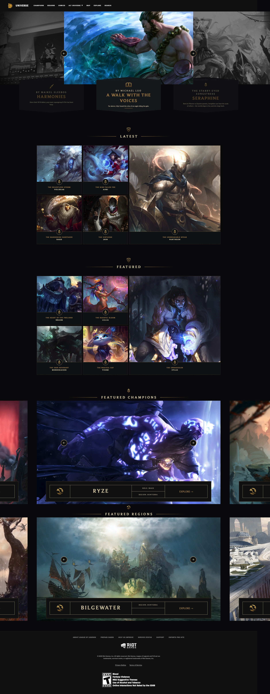
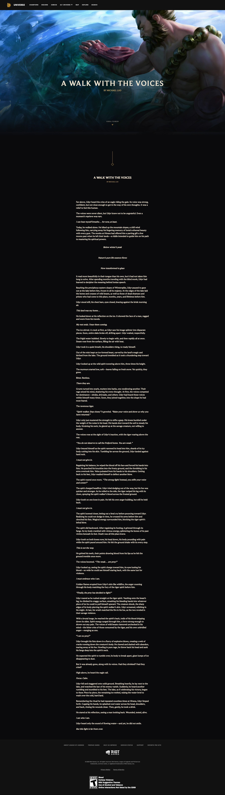

# Procesverslag

**Auteur:** -Maikel Sleebos-

## Bronnenlijst

- [MDN ParentElement](https://developer.mozilla.org/en-US/docs/Web/API/Node/parentElement)

- [Vue.js docs](https://vuejs.org/v2/guide/)
- [Vue CLI](https://cli.vuejs.org/guide/)
- [Vue.js Router](https://router.vuejs.org/guide/)
- [Vue.js References](https://router.vuejs.org/guide/)
- [Vue.js Methods and Events](https://v1.vuejs.org/guide/events.html)

- [Sass](https://sass-lang.com/guide)

Screenshot(s)

## Final Build

[Link naar build](https://thunderchicken.nl/freespace)

Screenshot(s)

## Vocal points

Waar ik mij vooral gericht op heb tijdens freespace is het leren van `Vue` en `SASS`.
Hierbij heb ik voornamelijk documentatie online voor gebruikt om een prototype te maken met een al bestaande website als richtlijn.

Ik heb mij hier ook geprobeerd uit te dagen door stukken uit de website ook te animeren naast het gewoon plat namaken in de carousel en de detail pagina.

### "Extras"

- Carousel
- Reading Scheme Toggle
- Reading Progress Bar

### Hardships

- Berekening voor progression
  - Was wat lastiger om precies uit te vogelen hoe en wat. Uiteindelijk een rekensom bedacht die min of meer doet wat nodig is.
- Gradients
  - De site heeft een aantal nice gradients op de borders. Uiteindelijk uitgevonden dat ze niet eens borders gebruiken maar extra elementen om een "Border" te krijgen met een gradient.

### Improvements/ToDo's

- Animaties kunnen slicker, Sommige delen zijn op de originele site anderes uitgebouwd om animaties te onderteunen. Hier helaas niet.
- Responsive maken
